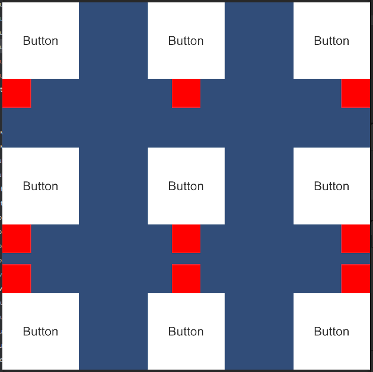

<p align="center">
  
</p>

# RectPop

[](LICENSE.md)

**Documentation ( [English](README.md), [日本語](README_JA.md) )**

RectPop provides features for developing floating UIs, such as popovers, tooltips, and context menus, easily and efficiently.

By lowering the barriers to unifying floating UIs, RectPop helps prevent the redundant implementation of similarly styled prefabs across different parts of your project.

<p align="center">
  
</p>

## Table of Contents

<!-- START doctoc generated TOC please keep comment here to allow auto update -->
<!-- DON'T EDIT THIS SECTION, INSTEAD RE-RUN doctoc TO UPDATE -->
<!-- param::title::Details:: -->
<details>
<summary>Details</summary>

- [Overview](#overview)
- [Features](#features)
  - [Easily unify floating UIs](#easily-unify-floating-uis)
  - [Place the UI within the rendering area](#place-the-ui-within-the-rendering-area)
  - [Support for All Render Modes](#support-for-all-render-modes)
  - [Floating Options](#floating-options)
    - [Modes](#modes)
    - [Offset](#offset)
  - [Multi-resolution support](#multi-resolution-support)
- [Setup](#setup)
  - [Installation](#installation)
- [Minimal usage](#minimal-usage)
- [Recommended usage](#recommended-usage)
- [License](#license)

</details>
<!-- END doctoc generated TOC please keep comment here to allow auto update -->

## Overview

When you submit a request to RectPop’s core system with any object that has a RectTransform and the Canvas on which that object is placed, the system returns the settings needed for displaying a floating UI as the result. By using RectPop’s UI modules, you can easily apply this result to your UI.

Additionally, as shown in the GIF at the beginning, RectPop provides features for reusing a single floating UI in multiple places. RectPop’s UI modules also allow the request context and the result context to remain loosely coupled.

## Features

### Easily unify floating UIs

As mentioned earlier, RectPop’s calculation logic does not require anything other than:

> An object with a `RectTransform` and the `Canvas` where the object is placed.

Furthermore, there are no constraints between the base object and the floating UI. This allows you to create a single floating UI and handle requests from various objects.

We also provide mechanisms to support this. For implementation examples, refer to [Example02Request.cs](Assets/RectPop/Examples/Sources/Example02Request.cs) and [Example02Result.cs](Assets/RectPop/Examples/Sources/Example02Result.cs).

### Place the UI within the rendering area

The response includes settings such as `Pivot` and `Anchor`. Applying these settings to the floating UI ensures that, in most cases, the UI remains visible within the screen.

> [!WARNING]
> Extremely large floating UIs or excessive offsets may cause the UI to exceed the screen boundaries.

We also provide methods required to apply these settings. Refer to the `Apply` method in [PopHandler.cs](Assets/RectPop/Sources/Runtime/PopHandler.cs).

### Support for All Render Modes

The `Canvas.RenderMode` includes `ScreenSpaceOverlay`, `ScreenSpaceCamera`, and `WorldSpace`, and RectPop supports all of them.

### Floating Options

#### Modes

There are three modes:

> [!NOTE]
> Floating positions can be customized. Inherit from `PopProvider` and override both `PopProvider.GetPopAnchorWorldPoint` and `PopProvider.GetPopPivotPosition`.

1. Inside

   Floats inside the object.

<p align="center">
  
</p>

2. OutsideVertical

   Floats above or below the object.

<p align="center">
  
</p>

3. OutsideHorizontal

   Floats to the left or right of the object.

<p align="center">
  
</p>

#### Offset

Offsets can be added to the top, bottom, left, or right.

<p align="center">
  
</p>

### Multi-resolution support

As shown in the [GIF at the top](#rectpop), RectPop returns calculation results considering the screen resolution. This ensures compatibility with devices of any resolution. Even in dynamic resolution changes, recalculating allows the floating UI to maintain its correct position.

## Setup

### Installation

You can install RectPop using Unity’s Package Manager.

1. Open Unity and select `Window` > `Package Manager`.
2. Click the `+` button in the top-left corner and select `Add package from git URL...`.
3. Enter the following URL:  
   `https://github.com/hashiiiii/RectPop.git?path=/Assets/RectPop/Sources`
4. Click `Add` to install the package.

For more details, please refer to [Installing from a Git URL](https://docs.unity3d.com/2019.4/Manual/upm-ui-giturl.html) in the Unity manual.

## Minimal usage

> [!NOTE]
> An example scene is available at `Assets/RectPop/Examples/Example01.unity`. Refer to it as needed.

1. Create a Canvas and an object with a RectTransform.

   In the Unity Editor, prepare a `Canvas` and a `RectTransform`, which will serve as the base for your floating UI.

2. Obtain an instance of `PopHandler`.

   `PopHandler` is a handler for the calculation logic (`IPopProvider`).

    ```csharp
    public class Example01 : MonoBehaviour
    {
        private readonly PopHandler _handler = new();
    }
    ```

   The `PopHandler` instance requires an `IPopProvider`. By default, the parameterless constructor uses `PopProvider`. In most cases, this will meet your requirements.

    ```csharp
    public class PopHandler
    {
        // static
        private static readonly IPopProvider Default = new PopProvider();
      
        // dependency
        private readonly IPopProvider _provider;
      
        // constructor
        public PopHandler(IPopProvider provider)
        {
            _provider = provider;
        }
      
        public PopHandler() : this(Default)
        {
        }
    
        // ----- code omitted -----
    }
    ```

> [!NOTE]
> If you do not need to handle multiple `IPopProvider` instances at once, you can treat the `PopHandler` instance as a singleton.

3. Run `PopHandler.RequestAndApply`.

   In this example, the floating UI is displayed when a button is clicked.

    ```csharp
    public class Example01 : MonoBehaviour
    {
        // base
        [SerializeField] private Canvas _baseCanvas;
        [SerializeField] private Button _button;
    
        // floating ui
        [SerializeField] private RectTransform _popRect;
        [SerializeField] private Canvas _popCanvas;
    
        private readonly PopHandler _handler = new();
    
        private void Awake()
        {
            _button.onClick.AddListener(() =>
            {
                // get base rect transform
                var baseRectTransform = _button.GetComponent<RectTransform>();
    
                // create request
                var request = new PopRequest(baseRectTransform, _baseCanvas);
    
                // send request and apply result to floating ui
                _handler.RequestAndApply(request, _popRect, _popCanvas);
    
                // show floating ui
                _popRect.gameObject.SetActive(true);
            });
        }
    }
    ```

## Recommended usage

In [Minimal usage](#minimal-usage), both the base UI and the floating UI are referenced and implemented in the same file. However, in practice, you might want to **unify floating UIs for multiple contexts**. Below is an example of how to separate them into different files.

> [!NOTE]
> An example scene is available at `Assets/RectPop/Examples/Example02.unity`. Refer to it as needed.

1. Follow steps 1 and 2 from [Minimal usage](#minimal-usage).

   This part is the same.

2. Run `PopHandler.Request`.

   This part is almost the same as step 3 in [Minimal usage](#minimal-usage). Since the display logic for the floating UI is delegated to a different class, the implementation is simpler.

    ```csharp
    public class Example02Request : MonoBehaviour
    {
        // base
        [SerializeField] private Canvas _baseCanvas;
        [SerializeField] private Button _button;
    
        private readonly PopHandler _handler = new();
    
        private void Awake()
        {
            _button.onClick.AddListener(() =>
            {
                // get base rect transform
                var baseRectTransform = _button.GetComponent<RectTransform>();
    
                // create request
                var request = new PopRequest(baseRectTransform, _baseCanvas);
    
                // send request
                _handler.Request(request);
            });
        }
    }
    ```

3. Run `PopHandler.Apply`.

   Here we create a class to display the floating UI. Subscribe to the `PopDispatcher.OnDispatched` event, receive the result, and display it.

    ```csharp
    public class Example02Result : MonoBehaviour
    {
        // floating ui
        [SerializeField] private RectTransform _floatingRect;
        [SerializeField] private Canvas _floatingCanvas;
    
        private readonly PopHandler _handler = new();
    
        // register event
        private void Awake()
        {
            PopDispatcher.OnDispatched += OnPopDispatched;
        }
    
        // unregister event
        private void OnDestroy()
        {
            PopDispatcher.OnDispatched -= OnPopDispatched;
        }
    
        // apply result to floating ui
        private void OnPopDispatched(PopDispatchedEvent ev)
        {
            _handler.Apply(ev.Result, _floatingRect, _floatingCanvas);
            _floatingRect.gameObject.SetActive(true);
        }
    }
    ```

> [!NOTE]
>
> While `PopDispatcher` is implemented using an `event`, you can aim for a cleaner implementation by using other OSS methods such as [R3.Observable.FromEvent](https://github.com/Cysharp/R3?tab=readme-ov-file#fromevent) (not yet tested, so not guaranteed).
>
> If replacing it, substitute `PopDispatcher` with a new class that uses `R3.Observable.FromEvent` or similar.
>
> Create a class inheriting from `PopHandler`, and override `PopHandler.Dispatch`.
>
> Use the replaced `PopDispatcher` class in the overridden `Dispatch` method.

## License

This software is released under the MIT License.  
You are free to use it within the scope of the license. However, the following copyright and license notices are required:

* [LICENSE.md](LICENSE.md)

Additionally, this document’s table of contents was generated using the following software:

* [toc-generator](https://github.com/technote-space/toc-generator)

For more details about the toc-generator license, refer to [Third Party Notices.md](Third%20Party%20Notices.md).