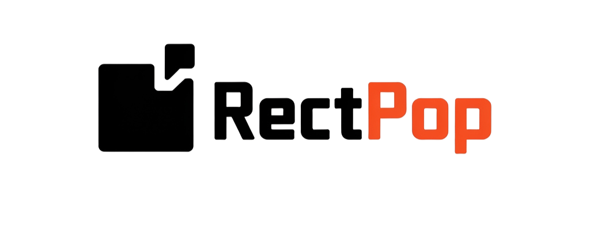

<p align="center">
  
</p>

# RectPop

[](LICENSE.md)

**Documentation ( [English](README.md), [Japanese](README_JA.md) )**

RectPop provides features to develop floating UIs such as popovers, tooltips, context menus, and more, **easily and efficiently**.

RectPop lowers the barrier to standardize floating UIs, helping to prevent similar-looking prefabs from being implemented multiple times throughout a project.

<p align="center">
  
</p>

## Table of Contents

<!-- START doctoc generated TOC please keep comment here to allow auto update -->
<!-- DON'T EDIT THIS SECTION, INSTEAD RE-RUN doctoc TO UPDATE -->
<!-- param::title::Details:: -->
<details>
<summary>Details</summary>

- [RectPop](#rectpop)
  - [Table of Contents](#table-of-contents)
  - [Overview](#overview)
  - [Features](#features)
    - [Easy Standardization of Floating UIs](#easy-standardization-of-floating-uis)
    - [Placing the UI Within the Render Area](#placing-the-ui-within-the-render-area)
    - [Supports All RenderModes](#supports-all-rendermodes)
    - [Floating Options](#floating-options)
      - [Mode](#mode)
      - [Offset](#offset)
    - [Support for Multiple Resolutions](#support-for-multiple-resolutions)
  - [Setup](#setup)
    - [Installation](#installation)
  - [Minimal Usage](#minimal-usage)
  - [Recommended Usage](#recommended-usage)
    - [R3, UniRx](#r3-unirx)
  - [License](#license)

</details>
<!-- END doctoc generated TOC please keep comment here to allow auto update -->

## Overview

By sending a request to RectPop's core system with (1) any object that has a RectTransform and (2) the Canvas in which that object is placed, RectPop returns the configuration needed to display the floating UI. Using RectPop’s UI modules, you can easily apply this result to your UI.

Moreover, as shown in the initial GIF, RectPop provides functionality that allows a single floating UI to be reused across multiple places. RectPop’s UI modules can **keep the request context and the result context loosely coupled**.

## Features

### Easy Standardization of Floating UIs

As mentioned above, RectPop’s calculation logic does not demand anything more than:

1. Any object that has a `RectTransform`
2. The `Canvas` in which that object is placed

Furthermore, there are no constraints between the floating UI and the base object, making it possible to use a single floating UI and send requests from various objects.

RectPop also provides the mechanism for this. For an implementation example, refer to Example02Request.cs and Example02Result.cs.

### Placing the UI Within the Render Area

The response contains settings for Pivot and Anchor. By applying these to the floating UI, in most cases the UI will remain on-screen.

> [!WARNING]
> If the floating UI is excessively large or you apply extreme offsets, it may end up going off-screen.

Methods needed for applying these settings are also provided. See the Apply method in PopHandler.cs.

### Supports All RenderModes

There are three `Canvas.RenderMode` values: `ScreenSpaceOverlay`, `ScreenSpaceCamera`, and `WorldSpace`. RectPop supports all of them.

### Floating Options

#### Mode

There are three modes:

> [!NOTE]
> You can change the floating position from the default.  
> Override PopProvider.GetPopAnchorWorldPoint and PopProvider.GetPopPivotPosition in a class that inherits from PopProvider.

1. Inside  
   Floats inside the object.

   <p align="center">
     
   </p>

2. OutsideVertical  
   Floats above or below the object.

   <p align="center">
     
   </p>

3. OutsideHorizontal  
   Floats to the left or right of the object.

   <p align="center">
     
   </p>

#### Offset

You can add offsets to the top, bottom, left, and right.

<p align="center">
  
</p>

### Support for Multiple Resolutions

As shown in the initial [GIF](#rectpop), RectPop calculates results based on the screen resolution. This means you can support any resolution and, in cases where the resolution changes dynamically, recalculating will display the floating UI in the correct position.

## Setup

### Installation

You can install RectPop via the Unity Package Manager.

1. Open Unity and select `Window` > `Package Manager`.
2. Click the `+` button in the top-left corner and choose `Add package from git URL...`.
3. Enter the following URL: `https://github.com/hashiiiii/RectPop.git?path=/Assets/RectPop/Sources#v1.1.0`
4. Click `Add` to install the package.

For more details, see the Unity manual on “Installing from a Git URL”.

## Minimal Usage

> [!NOTE]  
> There is an example in `Assets/RectPop/Examples/Example01.unity`. Please refer to it as needed.

1. Create a Canvas and an object that has a `RectTransform.`

   In the Unity Editor, prepare the `Canvas` that will be the base for your floating UI, and also the `RectTransform` object.

2. Obtain a `PopHandler` instance.

   `PopHandler` is a handler for the calculation logic (`IPopProvider`).

    ```csharp
    public class Example01 : MonoBehaviour
    {
        private readonly PopHandler _handler = new();
    }
    ```

   `PopHandler` requires an `IPopProvider`. The default constructor uses a `PopProvider`. In most cases, this will suffice.

    ```csharp
    public class PopHandler
    {
        // static
        private static readonly IPopProvider Default = new PopProvider();
      
        // dependency
        private readonly IPopProvider _provider;
      
        // constructor
        public PopHandler(IPopProvider provider)
        {
            _provider = provider;
        }
      
        public PopHandler() : this(Default)
        {
        }
    
        // ----- code omitted -----
    }
    ```

> [!NOTE]
> If you don’t need to handle multiple `IPopProvider` instances simultaneously, you could also treat the `PopHandler` instance as a singleton.

3. Execute `PopHandler.RequestAndApply`.

   In this example, we display the floating UI when the button is clicked.

    ```csharp
    public class Example01 : MonoBehaviour
    {
        // base
        [SerializeField] private Canvas _baseCanvas;
        [SerializeField] private Button _button;
    
        // floating ui
        [SerializeField] private RectTransform _popRect;
        [SerializeField] private Canvas _popCanvas;
    
        private readonly PopHandler _handler = new();
    
        private void Awake()
        {
            _button.onClick.AddListener(() =>
            {
                // get base rect transform
                var baseRectTransform = _button.GetComponent<RectTransform>();
    
                // create request
                var request = new PopRequest(baseRectTransform, _baseCanvas);
    
                // send request and apply result to floating ui
                _handler.RequestAndApply(request, _popRect, _popCanvas);
    
                // show floating ui
                _popRect.gameObject.SetActive(true);
            });
        }
    }
    ```

## Recommended Usage

In the Minimal Usage example, the base UI and the floating UI were both referenced within the same file. However, in reality, you will likely want to reuse a single floating UI in multiple places. Below is a recommended approach for such a scenario, separating each part into different files.

> [!NOTE]
> There is an example in `Assets/RectPop/Examples/Example02.unity`. Please refer to it as needed.

1. Refer to steps 1 and 2 in Minimal Usage.

   These steps are the same.

2. Execute `PopHandler.Request`.

   This is almost the same implementation as step 3 of [Minimal Usage](#minimal-usage). The difference is that we delegate the process of displaying the floating UI to another class, making this class more concise.

    ```csharp
   public class Example02Request : MonoBehaviour
   {
       // base
       [SerializeField] private Canvas _baseCanvas;
       [SerializeField] private Button _button;

       private readonly PopHandler _handler = new();

       private void Awake()
       {
           _button.onClick.AddListener(() =>
           {
               // get base rect transform
               var baseRectTransform = _button.GetComponent<RectTransform>();

               // create request
               var request = new PopRequest(baseRectTransform, _baseCanvas);

               // send request
               _handler.Request(request);
           });
       }
   }
   ```

3. Execute `PopHandler.Apply`.

   Here, we create a class that actually displays the floating UI. We subscribe to the `PopDispatcher.OnDispatched` event to receive the result and then display it.

    ```csharp
   public class Example02Result : MonoBehaviour
   {
       // floating ui
       [SerializeField] private RectTransform _floatingRect;
       [SerializeField] private Canvas _floatingCanvas;

       private readonly PopHandler _handler = new();

       // register event
       private void Awake()
       {
           PopDispatcher.OnDispatched += OnPopDispatched;
       }

       // unregister event
       private void OnDestroy()
       {
           PopDispatcher.OnDispatched -= OnPopDispatched;
       }

       // apply result to floating ui
       private void OnPopDispatched(PopDispatchedEvent ev)
       {
           _handler.Apply(ev.Result, _floatingRect, _floatingCanvas);
           _floatingRect.gameObject.SetActive(true);
       }
   }
   ```

### R3, UniRx

RectPop provides integrations so that you can more easily perform event-driven programming with the following OSS:

- R3 (https://github.com/Cysharp/R3)

    ```csharp
    public class Example02ResultForR3 : MonoBehaviour
    {
        // floating ui
        [SerializeField] private RectTransform _floatingRect;
        [SerializeField] private Canvas _floatingCanvas;
    
        private readonly CompositeDisposable _disposables = new();
        private readonly PopHandler _handler = new();
        
        // register event
        private void Awake()
        {
            PopDispatcher.OnDispatchedByR3AsObservable.Subscribe(OnPopDispatched).AddTo(_disposables);
        }
        
        // unregister event
        private void OnDestroy()
        {
            _disposables.Dispose();
        }
        
        // apply result to floating ui
        private void OnPopDispatched(PopDispatchedEvent ev)
        {
            _handler.Apply(ev.Result, _floatingRect, _floatingCanvas);
            _floatingRect.gameObject.SetActive(true);
        }
    }
    ```

> [!NOTE]
> There is an example in `Assets/RectPop/Examples/Example02ForR3.unity`. Please refer to it as needed.

- UniRx (https://github.com/neuecc/UniRx)

```csharp
    public class Example02ResultForUniRx : MonoBehaviour
    {
        // floating ui
        [SerializeField] private RectTransform _floatingRect;
        [SerializeField] private Canvas _floatingCanvas;
        
        private readonly CompositeDisposable _disposables = new();
        private readonly PopHandler _handler = new();
        
        // register event
        private void Awake()
        {
            PopDispatcher.OnDispatchedByUniRxAsObservable.Subscribe(OnPopDispatched).AddTo(_disposables);
        }
        
        // unregister event
        private void OnDestroy()
        {
            _disposables.Dispose();
        }
        
        // apply result to floating ui
        private void OnPopDispatched(PopDispatchedEvent ev)
        {
            _handler.Apply(ev.Result, _floatingRect, _floatingCanvas);
            _floatingRect.gameObject.SetActive(true);
        }
    }
```

> [!NOTE]
> There is an example in `Assets/RectPop/Examples/Example02ForUniRx.unity`. Please refer to it as needed.

These integrations do not require any additional configuration.  
If R3 or UniRx exist in your project, assembly resolution occurs dynamically.

> [!NOTE]
> For more details, see Assets/RectPop/Sources/Editor/RectPopDefineSymbolManager.cs.

## License

This software is released under the MIT License.  
You are free to use it within the scope of the license, but you must include the following copyright notice and license text when using this software:

- LICENSE.md

Additionally, the table of contents in this document was generated using the following software:

- toc-generator (https://github.com/technote-space/toc-generator)

For details on the toc-generator license, please see [Third Party Notices.md](Third%20Party%20Notices.md).
