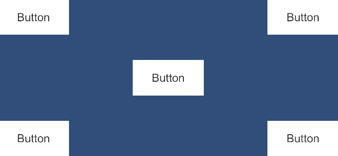



  

# RectPop

**ドキュメント ([English](README.md), [日本語](README_JA.md))**

ポップオーバー、ツールチップ、コンテキストメニューなどのフローティング UI を簡単に実装するためのモジュールを提供します。

  

## 目次
<!-- START doctoc generated TOC please keep comment here to allow auto update -->
<!-- DON'T EDIT THIS SECTION, INSTEAD RE-RUN doctoc TO UPDATE -->
<!-- param::title::詳細:: -->

詳細

- [概要](#%E6%A6%82%E8%A6%81)
- [特徴](#%E7%89%B9%E5%BE%B4)
  - [描画領域内への UI 配置](#%E6%8F%8F%E7%94%BB%E9%A0%98%E5%9F%9F%E5%86%85%E3%81%B8%E3%81%AE-ui-%E9%85%8D%E7%BD%AE)
  - [必要最小限のオプション](#%E5%BF%85%E8%A6%81%E6%9C%80%E5%B0%8F%E9%99%90%E3%81%AE%E3%82%AA%E3%83%97%E3%82%B7%E3%83%A7%E3%83%B3)
  - [複数解像度対応](#%E8%A4%87%E6%95%B0%E8%A7%A3%E5%83%8F%E5%BA%A6%E5%AF%BE%E5%BF%9C)
  - [疎結合な実装](#%E7%96%8E%E7%B5%90%E5%90%88%E3%81%AA%E5%AE%9F%E8%A3%85)
- [セットアップ](#%E3%82%BB%E3%83%83%E3%83%88%E3%82%A2%E3%83%83%E3%83%97)
  - [要件](#%E8%A6%81%E4%BB%B6)
  - [インストール](#%E3%82%A4%E3%83%B3%E3%82%B9%E3%83%88%E3%83%BC%E3%83%AB)
- [基本的な使い方](#%E5%9F%BA%E6%9C%AC%E7%9A%84%E3%81%AA%E4%BD%BF%E3%81%84%E6%96%B9)
- [ライセンス](#%E3%83%A9%E3%82%A4%E3%82%BB%E3%83%B3%E3%82%B9)

<!-- END doctoc generated TOC please keep comment here to allow auto update -->

## 概要
任意の `RectTransform` をリクエストとして渡すと、フローティング UI を表示するのにちょうど良い位置や設定を計算して返します。

## 特徴
### 描画領域内への UI 配置
レスポンスには `Pivot` や `Anchor` の設定が含まれています。これらをフローティング UI に適用することで、ほとんどのケースで画面内に UI を表示することができます。

> [!WARNING]
> フローティング UI そのものがあまりにも巨大な場合は画面外にはみ出します。

### 必要最小限のオプション
- Inside
- OutsideVertical
- OutsideHorizontal

以上の 3 つの配置モードがあります。

  

オフセットを追加することができます。

  

### 複数解像度対応
GIF でも示されているように、端末の解像度を加味した計算結果を返します。動的に解像度が変わるようなケースにおいても、再計算さえすれば正しい位置に UI を表示することができます。

### 疎結合な実装
RectPop のロジックは UI に依存しません。それゆえ、単一のフローティング UI を複数個所で使いまわすような実装も簡単に行うことができます。
## セットアップ

### 要件
* Unity 2019.3 or later

### インストール

RectPop は、Unity のパッケージマネージャーを使用してインストールできます。

1. Unity を開き、`ウィンドウ` > `パッケージマネージャー` を選択します。
2. 左上の `+` ボタンをクリックし、`Git URL からパッケージを追加...` を選択します。
3. 以下の URL を入力します。：`https://github.com/hashiiiii/RectPop.git?path=/Assets/RectPop/Sources`
4. `追加` をクリックしてパッケージをインストールします。

詳細については、Unity マニュアルの [Git URL からのインストール](https://docs.unity3d.com/ja/2019.4/Manual/upm-ui-giturl.html) を参照してください。

## 基本的な使い方
TBD

## ライセンス

本ソフトウェアはMITライセンスで公開しています。  
ライセンスの範囲内で自由に使っていただけますが、使用の際は以下の著作権表示とライセンス表示が必須となります。

* [LICENSE.md](LICENSE.md)

また、本ドキュメントの目次は以下のソフトウェアを使用して作成されています。

* [toc-generator](https://github.com/technote-space/toc-generator)

toc-generatorのライセンスの詳細は [Third Party Notices.md](Thirs%20Party%20Notices.md) を参照してください。