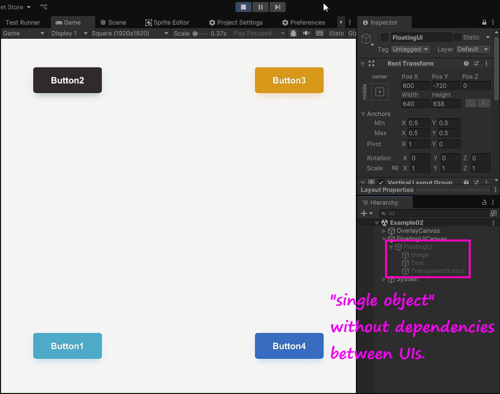
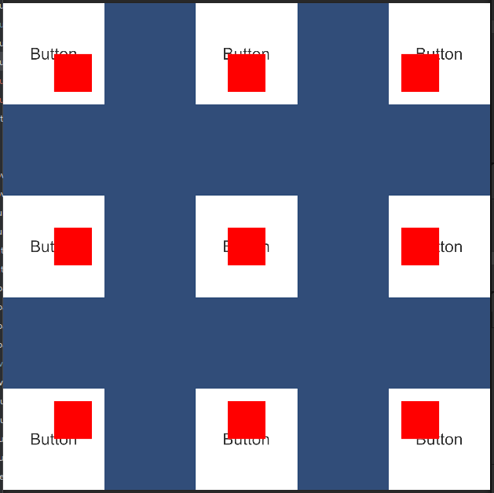
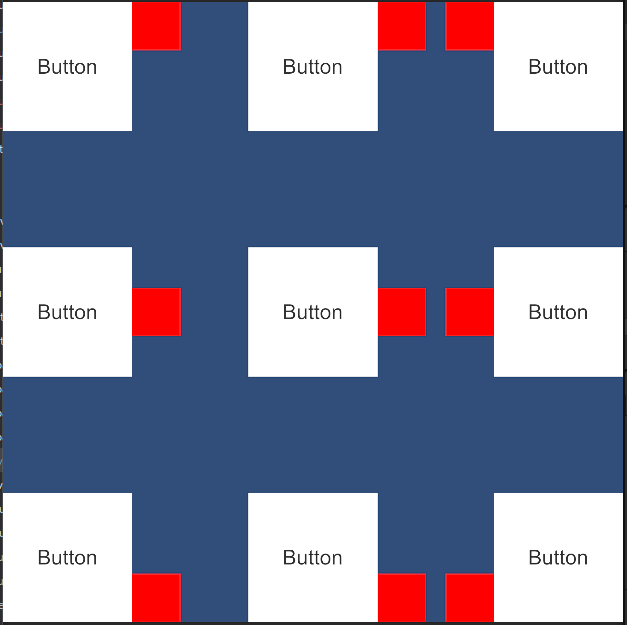

<p align="center">
  
</p>

# RectPop

[](LICENSE.md)

**ドキュメント ( [English](README.md), [日本語](README_JA.md) )**

RectPop はポップオーバー、ツールチップ、コンテキストメニューなどのフローティング UI を "**簡単に、効率良く**" 開発するための機能を提供します。

RectPop はフローティング UI 共通化のハードルを下げるため、同じような見た目のプレハブがプロジェクトの様々な個所で実装されてしまうといったことを予防します。

<p align="center">
  
</p>

## 目次

<!-- START doctoc generated TOC please keep comment here to allow auto update -->
<!-- DON'T EDIT THIS SECTION, INSTEAD RE-RUN doctoc TO UPDATE -->
<!-- param::title::詳細:: -->
<details>
<summary>詳細</summary>

- [概要](#%E6%A6%82%E8%A6%81)
- [特徴](#%E7%89%B9%E5%BE%B4)
  - [フローティング UI の共通化が容易](#%E3%83%95%E3%83%AD%E3%83%BC%E3%83%86%E3%82%A3%E3%83%B3%E3%82%B0-ui-%E3%81%AE%E5%85%B1%E9%80%9A%E5%8C%96%E3%81%8C%E5%AE%B9%E6%98%93)
  - [描画領域内への UI 配置](#%E6%8F%8F%E7%94%BB%E9%A0%98%E5%9F%9F%E5%86%85%E3%81%B8%E3%81%AE-ui-%E9%85%8D%E7%BD%AE)
  - [全ての RenderMode に対応](#%E5%85%A8%E3%81%A6%E3%81%AE-rendermode-%E3%81%AB%E5%AF%BE%E5%BF%9C)
  - [フローティングオプション](#%E3%83%95%E3%83%AD%E3%83%BC%E3%83%86%E3%82%A3%E3%83%B3%E3%82%B0%E3%82%AA%E3%83%97%E3%82%B7%E3%83%A7%E3%83%B3)
    - [モード](#%E3%83%A2%E3%83%BC%E3%83%89)
    - [オフセット](#%E3%82%AA%E3%83%95%E3%82%BB%E3%83%83%E3%83%88)
  - [複数解像度対応](#%E8%A4%87%E6%95%B0%E8%A7%A3%E5%83%8F%E5%BA%A6%E5%AF%BE%E5%BF%9C)
- [セットアップ](#%E3%82%BB%E3%83%83%E3%83%88%E3%82%A2%E3%83%83%E3%83%97)
  - [インストール](#%E3%82%A4%E3%83%B3%E3%82%B9%E3%83%88%E3%83%BC%E3%83%AB)
- [ミニマルな使い方](#%E3%83%9F%E3%83%8B%E3%83%9E%E3%83%AB%E3%81%AA%E4%BD%BF%E3%81%84%E6%96%B9)
- [おすすめの使い方](#%E3%81%8A%E3%81%99%E3%81%99%E3%82%81%E3%81%AE%E4%BD%BF%E3%81%84%E6%96%B9)
- [ライセンス](#%E3%83%A9%E3%82%A4%E3%82%BB%E3%83%B3%E3%82%B9)

</details>
<!-- END doctoc generated TOC please keep comment here to allow auto update -->

## 概要

RectPop のコアシステムに対して、`RectTransform` を持つ任意のオブジェクトと、そのオブジェクトが配置されている `Canvas` を request すると、フローティング UI の表示に必要な設定を result として返します。RectPop の UI モジュール群を使用することで、result を UI に対して簡単に適用できます。

さらに、冒頭の GIF からも分かるように単一の**フローティング UI を複数個所で使いまわすための機能**も提供しています。RectPop の UI モジュール群は **request のコンテキストと result のコンテキストを疎結合に保つ**ことができます。

## 特徴

### フローティング UI の共通化が容易

前述したように、RectPop の計算ロジックでは、

> `RectTransform` を持つ任意のオブジェクトと、そのオブジェクトが配置されている `Canvas`

以外を要求しません。更にはフローティング UI とベースとなるオブジェクトの間には制約が存在しません。それゆえに、フローティング UI を 1 つ作成しておいて、リクエストを様々なオブジェクトから送るといった使い方が可能です。

そのための仕組みも提供しています。実装例としては、[Example02Request.cs](Assets/RectPop/Examples/Sources/Example02Request.cs), [Example02Result.cs](Assets/RectPop/Examples/Sources/Example02Result.cs) をそれぞれ参照してください。

### 描画領域内への UI 配置

レスポンスには `Pivot` や `Anchor` の設定が含まれています。これらをフローティング UI に適用することで、ほとんどのケースで画面内に UI を表示することができます。

> [!WARNING]
> フローティング UI があまりにも巨大な場合や、過剰なオフセットを追加すると画面外に出てしまうことが想定されます。

設定の適用に必要なメソッドも提供しています。[PopHandler.cs](Assets/RectPop/Sources/Runtime/PopHandler.cs) の `Apply` メソッドを参照してください。

### 全ての RenderMode に対応

`Canvas.RenderMode` には `ScreenSpaceOverlay`, `ScreenSpaceCamera`, `WorldSpace` がありますが、RectPop はこれら全てに対応しています。

### フローティングオプション

#### モード

下記の 3 つがあります。

> [!NOTE]
> フローティング位置はデフォルトから変更が可能です。
> `PopProvider` を継承して、`PopProvider.GetPopAnchorWorldPoint`, `PopProvider.GetPopPivotPosition` を override してください。

1. Inside

    オブジェクトの内側からフローティングします。

<p align="center">
  
</p>

2. OutsideVertical

    オブジェクトの上下にフローティングします。

<p align="center">
  
</p>

3. OutsideHorizontal

    オブジェクトの左右にフローティングします。

<p align="center">
  
</p>

#### オフセット

上下左右にオフセットを追加することができます。

<p align="center">
  
</p>

### 複数解像度対応

[冒頭の GIF](#rectpop) からも分かるように、画面の解像度を加味した上で計算結果を返します。あらゆる解像度の端末にも対応できる上に、動的に解像度が変わるようなケースにおいても、再計算さえすれば正しい位置にフローティング UI を表示することができます。

## セットアップ

### インストール

RectPop は、Unity のパッケージマネージャーを使用してインストールできます。

1. Unity を開き、`ウィンドウ` > `パッケージマネージャー` を選択します。
2. 左上の `+` ボタンをクリックし、`Git URL からパッケージを追加...` を選択します。
3. 以下の URL を入力します。： `https://github.com/hashiiiii/RectPop.git?path=/Assets/RectPop/Sources#v1.0.3`
4. `追加` をクリックしてパッケージをインストールします。

詳細については、Unity マニュアルの [Git URL からのインストール](https://docs.unity3d.com/ja/2019.4/Manual/upm-ui-giturl.html) を参照してください。

## ミニマルな使い方

> [!NOTE]
> 例が `Assets/RectPop/Examples/Example01.unity` に置いてあるので、必要に応じて参照して下さい。

1. Canvas と RectTransform を持つオブジェクトをそれぞれ作成します。

    Unity Editor 上でフローティング UI のベースとなる `Canvas`, `RectTransform` を用意します。


2. `PopHandler` インスタンスを取得します。

    `PopHandler` は計算ロジック (`IPopProvider`) のハンドラーです。

    ```csharp
    public class Example01 : MonoBehaviour
    {
        private readonly PopHandler _handler = new();
    }
    ```

    `PopHandler` インスタンスは `IPopProvider` を要求します。デフォルトコンストラクタでは `PopProvider` が使用されています。ほとんどのケースで、こちらを使用すれば要件を満たせると思います。

    ```csharp
    public class PopHandler
    {
        // static
        private static readonly IPopProvider Default = new PopProvider();
      
        // dependency
        private readonly IPopProvider _provider;
      
        // constructor
        public PopHandler(IPopProvider provider)
        {
            _provider = provider;
        }
      
        public PopHandler() : this(Default)
        {
        }
    
        // ----- code omitted -----
    }
    ```

> [!NOTE]
> 同時に複数の `IPopProvider` を取り扱う必要がない場合は、`PopHandler` インスタンスはシングルトンとして扱うのも良いと思います。

3. `PopHandler.RequestAndApply` を実行します。

    今回の例では、ボタンのクリックイベントをトリガーにしてフローティング UI を表示します。

    ```csharp
    public class Example01 : MonoBehaviour
    {
        // base
        [SerializeField] private Canvas _baseCanvas;
        [SerializeField] private Button _button;
    
        // floating ui
        [SerializeField] private RectTransform _popRect;
        [SerializeField] private Canvas _popCanvas;
    
        private readonly PopHandler _handler = new();
    
        private void Awake()
        {
            _button.onClick.AddListener(() =>
            {
                // get base rect transform
                var baseRectTransform = _button.GetComponent<RectTransform>();
    
                // create request
                var request = new PopRequest(baseRectTransform, _baseCanvas);
    
                // send request and apply result to floating ui
                _handler.RequestAndApply(request, _popRect, _popCanvas);
    
                // show floating ui
                _popRect.gameObject.SetActive(true);
            });
        }
    }
    ```

## おすすめの使い方

[ミニマルな使い方](#ミニマルな使い方) のほうではベースとなる UI とフローティング UI を同じファイル内で参照して実装しました。しかし、実際の実装では **フローティング UI を共通化したいケース** が多いと思われます。そのようなケースに対応するために、それぞれを別のファイルに分けて実装する方法を紹介します。

> [!NOTE]
> 例が `Assets/RectPop/Examples/Example02.unity` に置いてあるので、必要に応じて参照して下さい。

1. [ミニマルな使い方](#ミニマルな使い方)の 1, 2 を確認してください。

    ここまでは同じです。


2. `PopHandler.Request` を実行します。

    こちらは[ミニマルな使い方](#ミニマルな使い方)の 3 とほぼ同じ実装となっています。フローティング UI の表示は別クラスに委譲しているため、よりシンプルな実装となっていることが分かります。

    ```csharp
    public class Example02Request : MonoBehaviour
    {
        // base
        [SerializeField] private Canvas _baseCanvas;
        [SerializeField] private Button _button;
    
        private readonly PopHandler _handler = new();
    
        private void Awake()
        {
            _button.onClick.AddListener(() =>
            {
                // get base rect transform
                var baseRectTransform = _button.GetComponent<RectTransform>();
    
                // create request
                var request = new PopRequest(baseRectTransform, _baseCanvas);
    
                // send request
                _handler.Request(request);
            });
        }
    }
    ```

3. `PopHandler.Apply` を実行します。

    ここではフローティング UI の表示を行うクラスを作成しています。`PopDispatcher.OnDispatched` イベントを購読し、結果を受け取って表示します。

    ```csharp
    public class Example02Result : MonoBehaviour
    {
        // floating ui
        [SerializeField] private RectTransform _floatingRect;
        [SerializeField] private Canvas _floatingCanvas;
    
        private readonly PopHandler _handler = new();
    
        // register event
        private void Awake()
        {
            PopDispatcher.OnDispatched += OnPopDispatched;
        }
    
        // unregister event
        private void OnDestroy()
        {
            PopDispatcher.OnDispatched -= OnPopDispatched;
        }
    
        // apply result to floating ui
        private void OnPopDispatched(PopDispatchedEvent ev)
        {
            _handler.Apply(ev.Result, _floatingRect, _floatingCanvas);
            _floatingRect.gameObject.SetActive(true);
        }
    }
    ```
    
> [!NOTE]
> 
> `PopDispatcher` は `event` を用いた実装となっていますが、[R3.Observable.FromEvent](https://github.com/Cysharp/R3?tab=readme-ov-file#fromevent) などの他 OSS のメソッドを用いることでよりスマートな実装を目指せると思います。(まだ試せていないので保証はできません)
> 
> 実際に置き換える場合には `PopDispatcher` を `R3.Observable.FromEvent` などの別の実装に差し替える必要があります。
>
> `PopHandler` を継承したクラスを作成し、`PopHandler.Dispatch` を override します。
>
> 先ほど作成した replaced `PopDispatcher` なクラスを上記で override した `Dispatch` メソッド内で使用してください。

## ライセンス

本ソフトウェアはMITライセンスで公開しています。  
ライセンスの範囲内で自由に使っていただけますが、使用の際は以下の著作権表示とライセンス表示が必須となります。

* [LICENSE.md](LICENSE.md)

また、本ドキュメントの目次は以下のソフトウェアを使用して作成されています。

* [toc-generator](https://github.com/technote-space/toc-generator)

toc-generatorのライセンスの詳細は [Third Party Notices.md](Thirs%20Party%20Notices.md) を参照してください。
